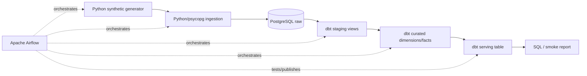

# Retail Data Platform

A Phase 1 data-engineering walking skeleton for a fictional e-commerce retailer. It generates deterministic daily CSV data, loads a real PostgreSQL raw layer, builds tested dbt models, and publishes a queryable sales summary under Airflow orchestration.

## Architecture and technology



The stack is deliberately small: Python 3.11, PostgreSQL 16, dbt-postgres, Apache Airflow 2.10 with LocalExecutor, Docker Compose, pytest, and Ruff. See [the implemented component map](docs/PROJECT_PLAN.md).

## Data model

| Layer | Objects | Purpose |
|---|---|---|
| Source files | `customers.csv`, `products.csv`, `orders.csv`, `order_items.csv` | Date-partitioned synthetic source |
| `raw` | `raw_customers`, `raw_products`, `raw_orders`, `raw_order_items` | Source-shaped history |
| `staging` | `stg_customers`, `stg_products`, `stg_orders`, `stg_order_items` | Typed, lightly cleaned views |
| `curated` | `dim_customers`, `dim_products`, `dim_date`, `fct_orders`, `fct_order_items` | Dimensional analytics model |
| `serving` | `daily_sales_summary` | Orders, items, revenue, and customers by day |

Each day creates 250 customers, 120 products, 600 orders, and typically more than 1,000 order items. IDs contain the logical date. Ingestion replaces only the requested date in one transaction; dbt rebuilds models from all raw history. Thus a rerun is idempotent while different dates coexist.

## Repository structure

```text
airflow/dags/       Airflow DAG
pipeline/           generator, ingestion, environment configuration
dbt/                staging, curated, serving models and tests
docker/postgres/    database initialization
scripts/smoke.sh    real-stack integration assertions
tests/              deterministic generator unit tests
docs/evidence/      evidence log and screenshot placeholders
.github/workflows/  pull-request CI
```

## Prerequisites

- Docker Engine with Compose v2
- GNU Make
- At least 4 GB RAM available to Docker
- Ports 5432 and 8080 free (or change `HOST_POSTGRES_PORT` / `AIRFLOW_WEB_PORT`)

## Fresh-clone setup and startup

```bash
git clone <repository-url>
cd retail-data-platform
cp .env.example .env
make up
```

`make up` builds the Airflow image, initializes Airflow metadata/admin user, then starts PostgreSQL, the scheduler, and webserver. Wait until `docker compose ps` reports healthy services. Open <http://localhost:8080> and sign in with the safe local defaults `admin` / `admin`. Change those values in `.env` outside a local demonstration.

All runtime connection settings come from `.env`; application code contains no host or credential defaults. `.env` is ignored by Git.

## Run the pipeline

The DAG is scheduled daily (`@daily`) and also supports manual runs. Trigger the default example date:

```bash
make trigger
```

Run a specific logical date (the DAG reads `dag_run.conf.logical_date`, falling back to Airflow's `ds`):

```bash
make trigger DATE=2026-01-02
```

Monitor it in the Airflow UI or with:

```bash
docker compose exec airflow-scheduler airflow dags list-runs -d retail_daily_pipeline
```

Tasks are deliberately separate: `generate_data → ingest_raw → dbt_staging → dbt_curated → data_quality → publish_serving`. Default trigger rules stop downstream tasks after a failure. Ingestion retries twice at one-minute intervals.

## Verify every layer

Use the real PostgreSQL container (the commands load credentials from Compose):

```bash
# RAW
docker compose exec postgres psql -U retail -d retail -c "select logical_date, count(*) from raw.raw_order_items group by 1 order by 1;"
# STAGING
docker compose exec postgres psql -U retail -d retail -c "select count(*) from staging.stg_orders;"
# CURATED
docker compose exec postgres psql -U retail -d retail -c "select count(*) from curated.fct_order_items;"
# SERVING / consumption proof
docker compose exec postgres psql -U retail -d retail -c "select * from serving.daily_sales_summary order by order_date;"
```

The pipeline's `data_quality` task runs dbt `not_null`, `unique`, relationships, and a custom non-empty fact test. Any failing query makes `dbt test` non-zero, fails the task, and prevents publication.

## Integration smoke test

After a successful run:

```bash
make smoke
```

This checks database connectivity, asserts non-empty raw/staging/curated/serving objects, prints row counts and the serving report, checks the configured expected date, and—when a DAG run exists—requires its latest state to be `success`.

## Idempotency and multiple dates

Run one partition twice, then inspect its stable count:

```bash
make trigger DATE=2026-01-01
# wait for success, then repeat
make trigger DATE=2026-01-01
docker compose exec postgres psql -U retail -d retail -c "select count(*) from raw.raw_orders where logical_date='2026-01-01';"
```

Run another date and show both remain:

```bash
make trigger DATE=2026-01-02
docker compose exec postgres psql -U retail -d retail -c "select logical_date, count(*) from raw.raw_orders group by 1 order by 1;"
```

## Demonstrate deliberate failure

Set `FORCE_INGEST_FAILURE=true` in `.env`, recreate Airflow containers so they receive it, and trigger a run:

```bash
sed -i.bak 's/FORCE_INGEST_FAILURE=false/FORCE_INGEST_FAILURE=true/' .env
docker compose up -d --force-recreate airflow-scheduler airflow-webserver
make trigger DATE=2026-01-03
docker compose exec airflow-scheduler airflow dags list-runs -d retail_daily_pipeline
```

After its two retries, `ingest_raw` fails deliberately; all downstream tasks are upstream-failed and the DAG run fails. Restore normal operation:

```bash
mv .env.bak .env
docker compose up -d --force-recreate airflow-scheduler airflow-webserver
```

`FORCE_INGEST_FAILURE` is false by default and is not a secret.

## Persistence test

PostgreSQL uses the named `postgres_data` volume. A normal stop does not remove it:

```bash
docker compose exec postgres psql -U retail -d retail -Atc "select count(*) from raw.raw_orders;"
make down
make up
docker compose exec postgres psql -U retail -d retail -Atc "select count(*) from raw.raw_orders;"
```

The two counts should match. Do **not** use `docker compose down -v` unless intentionally resetting all data.

## Logs, tests, and CI

Airflow UI task instances expose per-stage logs including logical date, input/output, and row counts. Container logs are available with `make logs`; files are also persisted under `./logs`.

```bash
make test       # pytest unit tests
make lint       # Ruff
make compile    # Python bytecode/syntax validation
make config     # resolved Compose validation
make dbt-parse  # dbt manifest parsing in the project image
```

CI runs those lightweight Python checks, Compose configuration validation, and dbt parsing for every pull request and push to `main`. The full Airflow smoke test remains a local integration check to keep CI economical.

## Shutdown and manual repository settings

```bash
make down
```

After review, a repository administrator should enable branch protection for `main`, require the CI check, and add real run screenshots to the marked locations in `docs/evidence/phase-1.md`. No release tag is created during implementation.

