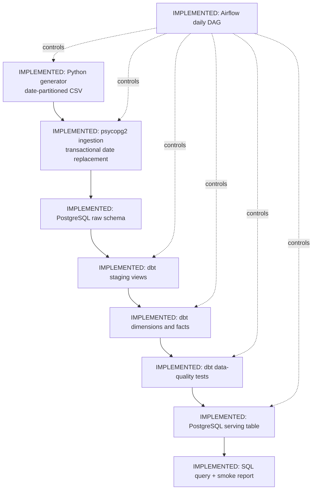

# Phase 1 Project Plan — Implemented Architecture

## Objective

This repository implements a reproducible batch walking skeleton. Every arrow below corresponds to checked-in code and an Airflow task; there are no manual data handoffs.

## Component mapping

| Flow step | Actual implementation | Operational property |
|---|---|---|
| Source | `pipeline/generate.py` writes four CSVs under `data/generated/<date>` | Seeded from the ISO date; repeatable and visibly partitioned |
| Ingestion | `pipeline/ingest.py` with psycopg2 | One transaction deletes and reloads only one logical date |
| Raw | PostgreSQL 16 `raw` schema | Source-like columns and durable named volume |
| Staging | Four dbt views in `dbt/models/staging` | Types and normalizes source records |
| Curated | Three dimensions and two facts in `dbt/models/curated` | Simple star-shaped analytical layer |
| Quality | Generic and singular dbt tests | Not-null, uniqueness, referential integrity, and non-empty fact checks |
| Serving | dbt table `serving.daily_sales_summary` | Daily orders, items, revenue, unique customers |
| Consumption | `scripts/smoke.sh` and documented `psql` query | Prints and asserts real database results |
| Orchestration | `airflow/dags/retail_pipeline.py` | Daily schedule, manual date override, retries, failure propagation |
| Runtime | `docker-compose.yml` | PostgreSQL, Airflow scheduler/webserver/init; no unnecessary platform |

## Scope choices

Phase 1 uses full-refresh dbt tables because the dataset is intentionally small; raw ingestion remains partition-idempotent. Stable date-prefixed keys avoid collisions across logical dates. Airflow's default `all_success` trigger rule provides fail-fast downstream propagation. PostgreSQL is shared as warehouse and Airflow metadata server but separate databases isolate those responsibilities.

