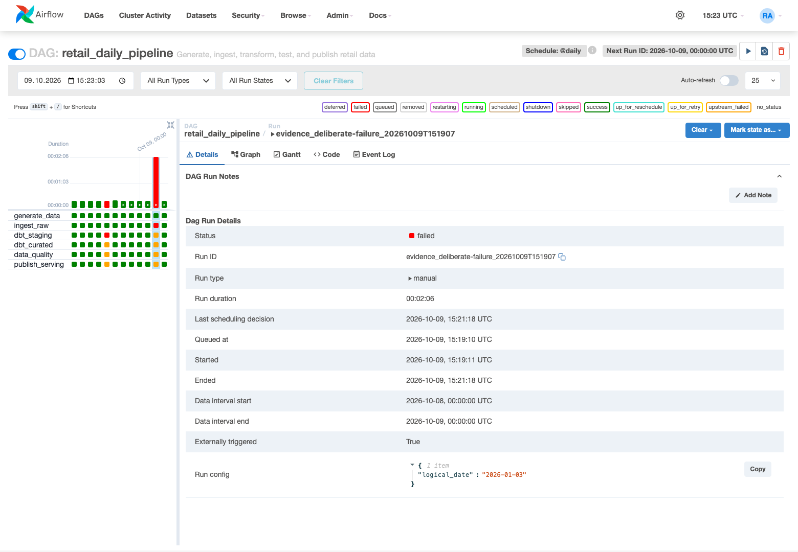

# Phase 1 Evidence

Verification date: **9 October 2026 (Asia/Baku, UTC+04:00)**. Terminal output and Airflow logs use UTC.

Code revision: `9e1ce87f2727b6859bb2618682225cce00d97ac8`. This report and its artifacts were collected against that revision with documentation changes in the working tree.

Runtime: Docker 29.7.2, Compose 5.4.0, Airflow 2.10.5, Python 3.11.11, PostgreSQL 16.15, dbt Core 1.12.5, and dbt-postgres 1.9.0. These are the observed versions in the running stack.

The checks below were performed against the local Docker Compose stack. PostgreSQL contained existing daily partitions, so whole-table counts include earlier runs. Date-specific checks use `2026-01-01` and `2026-01-02`.

## Verification Results

| Check | Result | Evidence |
|---|---|---|
| Python compilation, Ruff, unit tests, shell syntax | PASS | [Static Validation](#static-validation) |
| Docker Compose configuration and dbt parsing | PASS | [Static Validation](#static-validation) |
| Source volume and deterministic generation | PASS | [Synthetic Source Evidence](#synthetic-source-evidence) |
| Successful Airflow pipeline | PASS | [Successful Pipeline Run](#successful-pipeline-run) |
| Data layers and queryable sales summary | PASS | [Layer Row Counts](#layer-row-counts) |
| Integration smoke test | PASS | [Smoke Test](#smoke-test) |
| Same-date ingestion idempotency | PASS | [Idempotency Test](#idempotency-test) |
| Multiple logical dates | PASS | [Multiple Logical Dates Test](#multiple-logical-dates-test) |
| Database persistence after restart | PASS | [Infrastructure Restart / Persistence Test](#infrastructure-restart--persistence-test) |
| Deliberate failure, retries, downstream blocking | PASS | [Deliberate Failed Run](#deliberate-failed-run) |
| Recovery after restoring normal configuration | PASS | [Recovery and Final State](#recovery-and-final-state) |

## Successful Pipeline Run

**Status: PASS — observed.**

The DAG was triggered with `logical_date=2026-01-01`. Its run ID was `evidence_success_20261009T151745`. The run finished with state `success`.

```bash
docker compose exec -T airflow-scheduler airflow dags trigger retail_daily_pipeline \
  --run-id evidence_success_20261009T151745 \
  --conf '{"logical_date":"2026-01-01"}'
docker compose exec -T airflow-scheduler airflow tasks states-for-dag-run \
  retail_daily_pipeline evidence_success_20261009T151745 -o table
```

All six tasks completed successfully:

| Task | State | Observed result |
|---|---|---|
| `generate_data` | success | Four CSV datasets; 3,068 rows in total |
| `ingest_raw` | success | 250 customers, 120 products, 600 orders, 2,098 order items |
| `dbt_staging` | success | Four staging views built |
| `dbt_curated` | success | Five curated tables built |
| `data_quality` | success | 17 dbt tests passed, zero errors |
| `publish_serving` | success | Serving table built; both serving tests passed |


Evidence: [run metadata](artifacts/success-run.json), [task states](artifacts/success-tasks.txt), [staging log](artifacts/success-dbt_staging.log), [curated log](artifacts/success-dbt_curated.log), [quality test log](artifacts/success-data_quality.log), [serving log](artifacts/success-publish_serving.log).

## Synthetic Source Evidence

**Status: PASS — observed.**

The generator was run twice for `2026-01-01` in a temporary directory inside the project image. The row counts and SHA-256 hashes matched for every source file.

| Dataset | First generation | Second generation |
|---|---:|---:|
| customers | 250 | 250 |
| products | 120 | 120 |
| orders | 600 | 600 |
| order_items | 2,098 | 2,098 |

The order-item dataset exceeds 1,000 rows. Identical file hashes demonstrate repeatable source generation. Database rerun behavior was checked separately below.

Evidence: [row counts and both sets of SHA-256 hashes](artifacts/source-determinism.txt), [Airflow generator log](artifacts/success-generate_data.log).

## Layer Row Counts

**Status: PASS — observed.**

After the successful run, counts were queried directly from PostgreSQL. Every checked relation was non-empty. These counts were captured before the additional `2026-01-02` partition was loaded.

```text
relation           | count
-----------------------------+-------
 raw.raw_customers           |  1750
 raw.raw_products            |   840
 raw.raw_orders              |  4200
 raw.raw_order_items         | 14618
 staging.stg_orders          |  4200
 curated.fct_orders          |  4200
 curated.fct_order_items     | 14618
 serving.daily_sales_summary |     7
(8 rows)
```
The serving table was queried for the test date:

```sql
select * from serving.daily_sales_summary where order_date='2026-01-01';
```

```text
order_date | total_orders | total_items | gross_revenue | unique_customers
------------+--------------+-------------+---------------+------------------
 2026-01-01 |          600 |        5278 |     657501.87 |              231
(1 row)
```

The result contains 600 orders, 5,278 units, gross revenue of 657,501.87, and 231 distinct customers. `total_items` sums quantities; it is different from the 2,098 order-item rows.

Evidence: [layer count query and output](artifacts/layer-counts.txt), [serving query and output](artifacts/serving-result.txt).

## Smoke Test

**Status: PASS — observed.**

`make smoke` completed with exit code `0`. It checked PostgreSQL connectivity, non-empty objects across the four layers, the serving result for the configured date, and the latest Airflow run state.

```text
bash scripts/smoke.sh
Checking PostgreSQL connectivity...
 postgres_reachable
--------------------
                  1
(1 row)

raw.raw_customers: 1750 rows
staging.stg_orders: 4200 rows
curated.fct_order_items: 14618 rows
serving.daily_sales_summary: 7 rows
Serving output:
 order_date | total_orders | total_items | gross_revenue | unique_customers
------------+--------------+-------------+---------------+------------------
 2026-01-01 |          600 |        5278 |     657501.87 |              231
 2026-10-01 |          600 |        5318 |     660194.40 |              225
 2026-10-02 |          600 |        5099 |     675310.39 |              231
 2026-10-03 |          600 |        5217 |     670083.29 |              229
 2026-10-04 |          600 |        5156 |     696794.86 |              229
 2026-10-05 |          600 |        5317 |     675227.94 |              231
 2026-10-08 |          600 |        5216 |     649739.44 |              221
(7 rows)

Latest Airflow run state: success
Smoke test passed.
```

Evidence: [complete smoke test output](artifacts/smoke.txt).

## Idempotency Test

**Status: PASS — observed.**

The successful `2026-01-01` partition was counted, then the same date was triggered again. Both runs succeeded. The before and after outputs were identical.

Second run: `evidence_rerun_20261009T151809`.

| Dataset | Before rerun | After rerun |
|---|---:|---:|
| customers | 250 | 250 |
| products | 120 | 120 |
| orders | 600 | 600 |
| order_items | 2,098 | 2,098 |

A separate query compared row counts with distinct business-key counts for all four datasets. Each pair matched, confirming that the partition had no duplicate business keys.

```text
dataset   | rows | distinct_keys
-------------+------+---------------
 customers   |  250 |           250
 products    |  120 |           120
 orders      |  600 |           600
 order_items | 2098 |          2098
(4 rows)
```

Evidence: [before counts](artifacts/idempotency-before.txt), [after counts](artifacts/idempotency-after.txt), [rerun metadata](artifacts/rerun-run.json), [rerun task states](artifacts/rerun-tasks.txt), [business-key uniqueness check](artifacts/unique-business-keys.txt).

## Multiple Logical Dates Test

**Status: PASS — observed.**

The pipeline was triggered for `2026-01-02` and reached `success`. Querying the raw orders table confirmed that the earlier date remained and that both dates had 600 orders.

Run ID: `evidence_second-date_20261009T151830`.

```text
logical_date | orders
--------------+--------
 2026-01-01   |    600
 2026-01-02   |    600
(2 rows)
```

Evidence: [date-specific query and output](artifacts/multiple-dates.txt), [run metadata](artifacts/second-date-run.json), [task states](artifacts/second-date-tasks.txt).

## Infrastructure Restart / Persistence Test

**Status: PASS — observed.**

The total raw order count was captured before stopping the Compose stack. The stack was stopped with `docker compose down`, then started with `docker compose up -d postgres airflow-webserver airflow-scheduler`. The PostgreSQL named volume was retained.

| Measurement | Raw orders |
|---|---:|
| Before shutdown | 4,800 |
| After startup | 4,800 |

The identical counts confirm persistence across the stack restart. The total includes pre-existing partitions and both test dates.

Evidence: [before count](artifacts/persistence-before.txt), [shutdown output](artifacts/persistence-stop.txt), [startup output](artifacts/persistence-start.txt), [after count](artifacts/persistence-after.txt).

## Deliberate Failed Run

**Status: PASS — observed.**

`FORCE_INGEST_FAILURE` was temporarily set to `true` and both Airflow services were recreated. The DAG was triggered for the unused date `2026-01-03`.

Run ID: `evidence_deliberate-failure_20261009T151907`. Final DAG state: `failed`.

| Task | Final state |
|---|---|
| `generate_data` | success |
| `ingest_raw` | failed |
| `dbt_staging` | upstream_failed |
| `dbt_curated` | upstream_failed |
| `data_quality` | upstream_failed |
| `publish_serving` | upstream_failed |

The ingestion logs show three attempts: the initial attempt and two retries. Each attempt raised `RuntimeError: Deliberate ingestion failure: FORCE_INGEST_FAILURE=true`. The final attempt failed, and all four downstream tasks were blocked.



Evidence: [failed run metadata](artifacts/deliberate-failure-run.json), [final task states](artifacts/deliberate-failure-tasks.txt), [attempt 1](artifacts/failure-ingest-attempt=1.log), [attempt 2](artifacts/failure-ingest-attempt=2.log), [attempt 3](artifacts/failure-ingest-attempt=3.log).

## Recovery and Final State

**Status: PASS — observed.**

The original `.env` content was restored after the failure test and the Airflow services were recreated. A new run for `2026-01-01` completed successfully, and `make smoke` passed again.

Recovery run: `evidence_recovery_20261009T152128`.

```text
bash scripts/smoke.sh
Checking PostgreSQL connectivity...
 postgres_reachable
--------------------
                  1
(1 row)

raw.raw_customers: 2000 rows
staging.stg_orders: 4800 rows
curated.fct_order_items: 16676 rows
serving.daily_sales_summary: 8 rows
Serving output:
 order_date | total_orders | total_items | gross_revenue | unique_customers
------------+--------------+-------------+---------------+------------------
 2026-01-01 |          600 |        5278 |     657501.87 |              231
 2026-01-02 |          600 |        5177 |     635259.71 |              228
 2026-10-01 |          600 |        5318 |     660194.40 |              225
 2026-10-02 |          600 |        5099 |     675310.39 |              231
 2026-10-03 |          600 |        5217 |     670083.29 |              229
 2026-10-04 |          600 |        5156 |     696794.86 |              229
 2026-10-05 |          600 |        5317 |     675227.94 |              231
 2026-10-08 |          600 |        5216 |     649739.44 |              221
(8 rows)

Latest Airflow run state: success
Smoke test passed.
```

Evidence: [service recreation](artifacts/failure-restore.txt), [recovery run metadata](artifacts/recovery-run.json), [recovery task states](artifacts/recovery-tasks.txt), [final smoke output](artifacts/final-smoke.txt).

## Static Validation

**Status: PASS — observed.**

The project image was used to run Python compilation, Ruff, pytest, and shell syntax validation against a read-only mount of the repository:

```bash
PYTHONPYCACHEPREFIX=/tmp/evidence-pycache python -m compileall -q pipeline airflow/dags tests
ruff check --no-cache pipeline tests airflow/dags
pytest -q -p no:cacheprovider -o pythonpath=.
bash -n scripts/smoke.sh
```

```text
Container retail-data-platform-airflow-scheduler-run-7a2a712918e1 Creating
 Container retail-data-platform-airflow-scheduler-run-7a2a712918e1 Created

All checks passed!
.....                                                                    [100%]
5 passed in 0.03s
```
Compose configuration validation and dbt parsing also returned exit code `0`:

```bash
docker compose config --quiet
docker compose exec -T airflow-scheduler dbt parse \
  --project-dir /opt/airflow/project/dbt \
  --profiles-dir /opt/airflow/project/dbt
```

```text
15:17:44  Running with dbt=1.12.5
15:17:44  Registered adapter: postgres=1.9.0
15:17:44  Unable to do partial parsing because a project config has changed
15:17:44  Performance info: /opt/airflow/project/dbt/target/perf_info.json
```

Evidence: [static check output](artifacts/static-validation.txt), [Compose validation](artifacts/compose-config.txt), [dbt parse output](artifacts/dbt-parse.txt), [initial service health](artifacts/services.txt).

## Reproduction

The main operational commands are documented in the [README](../../README.md). For each triggered DAG, wait for a terminal state before collecting SQL results. Run the smoke check after a successful DAG, because it requires the latest run to be successful.

The complete collection record, including command outputs and run metadata, is available in [collection.json](artifacts/collection.json). Screenshots and task logs refer to the explicit run IDs recorded above. Application code was unchanged during evidence collection.
